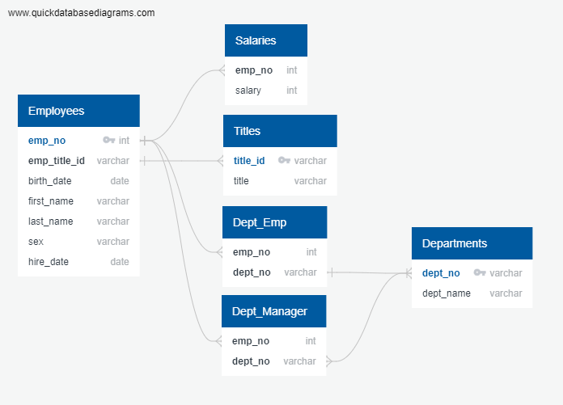

The SQL challenge aimed to create a new SQL database from a several CSV files. First an ERD was created to identify primary keys, foreign keys, and other constraints. After understanding the relationships between each table, a table schema was created to each of the CSV files and uploaded into a PostgreSQL server. 

After the tables were created, a simple data analysis was performed by performing a variety of queries, some simple, some more complex.

The final portion of the challenge utilized SQLAlchemy to make queries from a Jupyter Notebook to the PostgreSQL server and perform an exploratory analysis. 

